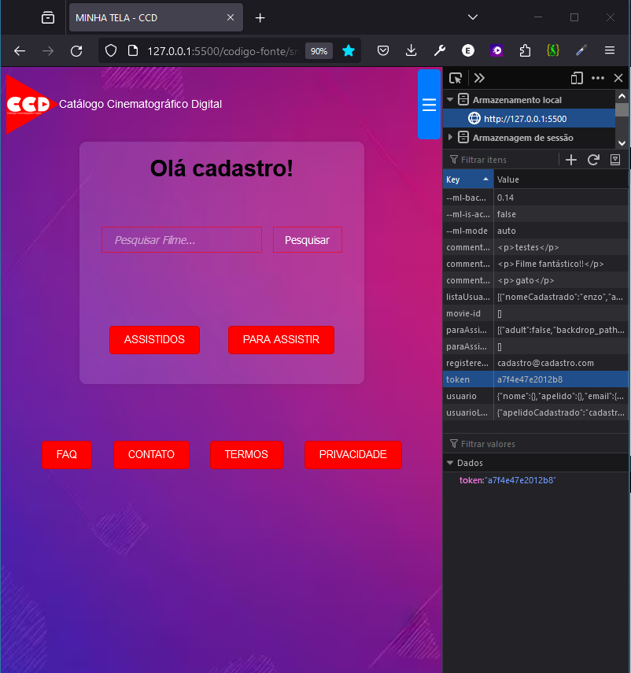
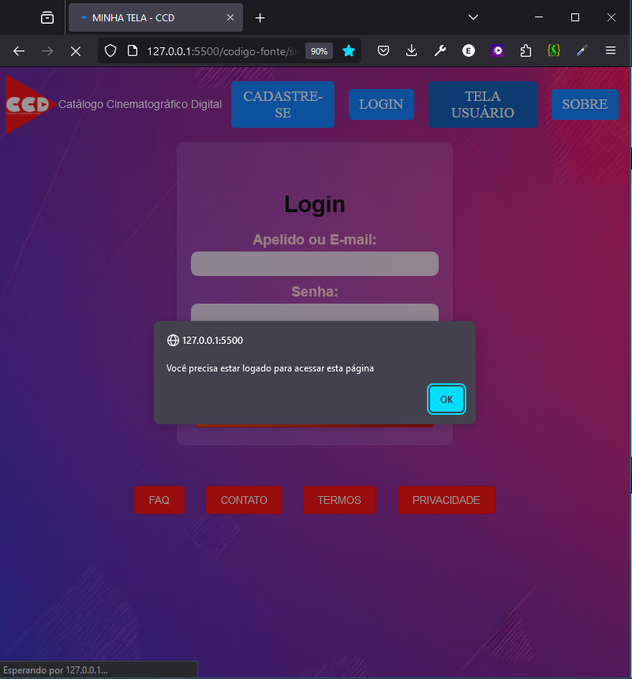

# Registro de Testes de Software

Relatório com as evidências dos testes de software realizados na aplicação pela equipe, baseado no plano de testes pré-definido.

Os resultados dos testes funcionais realizados na aplicação são descritos a seguir.

|Caso de Teste    | CT-01 - Cadastro do Usuário |
|:---|:---|
| Resultados obtidos | Perfil do usuário armazenado no Local Storage  |
| Responsável pela execução do caso de Teste | Enzo |

 

A. Dentro da tela Cadastro.html, o campo nome poderá receber letras maiúsculas e minúsculas, porém nenhum caractere especial ou numérico. 
B. O campo email deve ter na estrutura os caracteres "@" e o "." após.
C. O campo senha deve conter no mínimo 1 algarismo numérico, 1 caractere especial, 1 letra maiúscula e 1 letra minúscula.
D. Se o campo confirmar senha estiver diferente do campo, não possibilita cadastro. 
E. Cadastro só é realizado se todas os requisitos foram cumpridos e não houver nenhum campo vazio.
F. Cadastro realizado, aparecerá mensagem "usuário cadastrado" e após 1 segundo será direcionado a página login.html automaticamente. Cadastro sendo salvo dentro do local storage.

 

|Caso de Teste    | CT-02 - Login do Usuário |
|:---|:---|
| Resultados obtidos | Login concluído, caso os dados estejam corretos, será redirecionado, automaticamente, para a Tela do Usuário.  |
| Responsável pela execução do caso de Teste | Enzo |
 

A. Login só será realizado se o apelido ou email e senha estiverem cadastrados para um usuário. Senhas e apelidos ou emails divergindo não será realizado o login.  
B. Se login for bem sucedido, será redirecionado automaticamente para a 'Tela usuário'. Apelido irá  aparecer como saudação na 'Tela usuário'. Um token randômico será salvo no local storage indicando que determinado usuário está logado. 
C. Caso usuário queira se deslogar, o token será  retirado do local storage. Caso não haja token salvo no local Storage não é possível acessar 'Tela usuário'. 

  

Figura A: Login sem sucesso.  

  

Figura B: Login com sucesso. Token salvo no local storage.  

  
Figura C: Ao clicar no botão "sair" na tela de usuário, token é apagado do local storage, impossibilitando acesso a 'Tela usuário'.  

 

|Caso de Teste    | CT-05 - Pesquisa de Filmes / Séries |
|:---|:---|
| Resultados obtidos | A(s) palavra(s) chave(s) pesquisadas foram entregues em forma de opções de filmes/séries no resultado da busca.  |
| Responsável pela execução do caso de Teste | Enzo |

 

|Caso de Teste    | CT-06 - Cadastro de Filmes / Séries |
|:---|:---|
| Resultados obtidos | No local Storage, aparecem os filmes cadastrados, conforme escolha do usuário na forma de filmes/séries Para Assistir e Assistidos.  |
| Responsável pela execução do caso de Teste | Enzo |

 

|Caso de Teste    | CT-07 - Inserir Filmes/Séries na Lista de Assistidos e Para Assistir |
|:---|:---|
| Resultados obtidos | O filme/série pesquisado será armazenado no Local Storage da Lista de Assistidos ou A Assistir.  |
| Responsável pela execução do caso de Teste | Márcia Miranda |

 

Sequência de teste:

A.	Após resultado da Busca, na Tela do Usuário, clicar na imagem do filme de preferência. 
B.	Uma janela pop-up aparecerá, com informações relevantes sobre o filme. 
C.	O usuário pode escolher clicar no botão “Lista para Assistir” ou “Lista Assistidos”. 
D.	Após clicar em um dos botões, aparecerá uma janela Pop-up, confirmando a operação realizada com sucesso.

Figura: (A): resultado da busca; (B) Pop-up com informações do filme escolhido; (C) Pop-up com confirmação do filme adicionado à Lista Para Assistir; (D) Filme na lista do Local Storage.

 

|Caso de Teste    | CT-08 - Listar Filmes/Séries Assistidos e Para Assistir |
|:---|:---|
| Resultados obtidos | O filme/série pesquisado será armazenado no Local Storage da Lista de Assistidos ou A Assistir.  |
| Responsável pela execução do caso de Teste | Márcia Miranda |

Sequência de teste:  

A.	O usuário, já logado, poderá escolher em qual lista adicionar o filme, clicando no botão “Assistidos” ou “Para Assistir”. 
B.	Se clicar no botão “Assistidos”, aparecerão as imagens dos filmes escolhidos como Assistidos, na busca realizada anteriormente. 
C.	Se clicar no botão “Para Assistir”, aparecerão as imagens dos filmes escolhidos como Para Assistir, na busca realizada anteriormente.

Figura: (A): Tela do Usuário; (B) Lista de Filmes da Lista Para Assistir; (C) Lista de Filmes Assistidos.

 

|Caso de Teste    | CT-09 - Manutenção e Exclusão de Filmes/Séries na Lista Assistidos e Para Assistir |
|:---|:---|
| Resultados obtidos | A lista de filmes “Assistidos” ou “Para Assistir” exibem, corretamente, os filmes inseridos ou excluídos.  |
| Responsável pela execução do caso de Teste | Caio Costa |

Sequência de teste:  

A. Após Login, o usuário escolhe qual lista visualizar, clicando no botão “Assistidos” ou “Para Assistir”. 
B. Após exibição da lista de filmes selecionado, o usuário escolhe o filme desejado, clicando na sua imagem. 
C. Uma janela pop-up aparecerá, contendo os dados do filme. 
    - Caso o usuário tenha clicado na lista “Para Assistir”, pode adicionar à lista de “Assistidos” ou “Remover”. 
    - Caso o usuário tenha clicado na lista “Assistidos” poderá escolher “Remover” o filme da lista. 
D.	Aparecerá uma janela Pop-up, confirmando a execução da operação com sucesso.

Figura: (A) e (B): Após login, Tela com lista de filmes “Assistidos” e seu armazenamento no Local Storage; (C) Janela Pop-up com informações do filme selecionado e botão para Remover filme da lista.

 

|Caso de Teste    | CT-10 - Inserção de Avaliações e Comentários em Filmes Assistidos |
|:---|:---|
| Resultados obtidos | No Local Storage da Lista de Assistidos, estarão armazenados os comentários e classificação do filme. |
| Responsável pela execução do caso de Teste | Caio Costa |

Sequência de teste:  

1.	O usuário clica no botão “Assistidos” e aparece a lista de filmes assistidos e escolhe o filme de sua preferência. 
2.	Abrirá uma janela pop-up com a sinopse do filme, data de lançamento, duração, etc., além de um espaço para inserir comentários a respeito do filme e de uma área para classificar o filme entre 1 a 5 estrelas. 
3.	Após realizar o comentário e classificar o filmes, o usuário pode fechar a janela, clicando no “X”, no canto superior direito.

Figura: Após login, Tela com lista de filmes “Assistidos”.

Figura: Janela Pop-up do filme escolhido antes de efetuar a classificação e depois da classificação em 5 estrelas.

Figura: Janela Pop-up do filme escolhido antes do comentário e depois de digitar comentários.

Figura: Local Storage do filme com os comentários inseridos.

 

